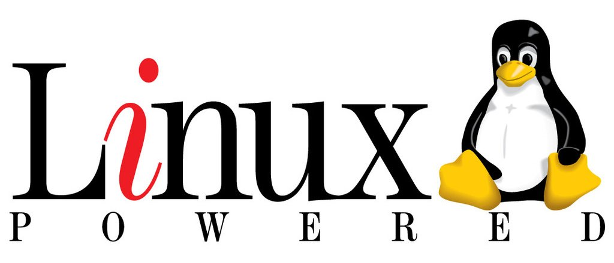

# 什么是Linux？

Linux似乎是一个很神奇的存在。没有深入了解过电脑相关知识的人，可能仅仅是听过名字。就算是对计算机有所了解，大部分人潜意识中都觉得Linux是高不可攀的。

其实现今的Linux并没有想像中的那么高大上。它也可以很友好，很实用，并不仅仅是用作你看不见的服务器，或者是黑客用来进攻其它计算机的工具（不是只有黑客在用Linux！）。

## 操作系统（Operating System）

我们平时使用的电脑的时候，都是通过操作系统间接地使用电脑的硬件的。你不用手动去控制CPU，内存等等，通常情况下这些东西会由操作系统帮你弄好。大部分人使用的Windows就是操作系统。同时，Apple也有它的电脑系统Mac OSX，还有手机的两大阵营：Android与IOS，其中的“Android”和“IOS”也是操作系统。

我们今天的话题Linux，其本身并不能算是一个操作系统的名字。你如果点开[Debian](https://www.debian.org)的官网，你应该会看到[GNU](https://www.gnu.org)/Linux这种字样。GNU起到的作用就好比Windows里你的常用预装软件一样，比如记事本等等。虽然这么比较有点欠妥当。Linux只负责系统中最底层的部分（如内存分配，CPU调度等等），而GNU则为我们使用Linux提供了最基本的功能。所以我们通常说的Linux系统的全称应该叫作GNU/Linux。不过在日常的场合下，大可不必在意这种区别了。

其实Linux本身是一个内核的名称，是由一个叫作Linus的程序员最初编写的。在内核之上运行着GNU的软件，这才构成了最基本的Linux系统。

## 为什么Linux如此特殊？

GNU/Linux与Windows，MacOS比起来了解者甚少，使用者数量更是差了10倍以上。但是这依旧不仿碍它在操作系统中占有一席之地。为什么呢？这很大程度上是因为Linux本身的**开放性**。

你使用Windows或者MacOS的时候，它们是如何运作你是**无法完整地知晓**的。这一切都掌握在编写它们的微软和苹果那里。虽然我个人并不觉得它们会有什么不好的动作，比如在你的电脑上放一个后门之类的事情，但是很重要的是，你是没有办法随意更改系统相关的东西的。你不知道系统里的一个东西是如何运行的，你也就没有办法针对它进行更换，优化，个性化。

但是GNU/Linux就有所不同。不管是GNU，还是作为底层内核的Linux，都是开源的。“开源”就是指你可以免费地获得它们的源代码。这意味着它们是怎么运作的你完全可以知道。当然你没有水平看懂源代码也没有关系（放心我也看不懂），因为这个世界上的_**60亿**_人口**总有**看得懂的人存在。任何人都可以去修改它们的源码，这样它们当中就不可能含有后门（不会有人想在自己的电脑上有不明所以的东西存在吧），一但有问题发现就会很快的被更正。然而像Windows这类，你必须要等微软发布补丁。同时因为源代码与生态的开放性，开发者们可以随意地编写分享他们的Linux程序，没有垄断的存在，相同的事情你可以有更多选择。比如在Windows上你只能用Windows自带的桌面，但是在Linux上你可以用KDE，GNOME等等，这会在后面讲到。

_**那么就开始我们的Linux相关学习吧！如果你在看本书时还没有能力安装archlinux，你可以选择基archlinux的其它发行版进行尝试。比如**_[_**`Manjaro`**_](https://manjaro.org)_**，**_[_**Arco Linux**_](https://arcolinux.com)_**等等。如果你使用的是别的Linux发行版，甚至是意义不明的Deepin也没有关系。大部分都将是通用的知识。**_

Manjaro的镜像可以在[BFSU镜像站](https://mirrors.bfsu.edu.cn)找到。

